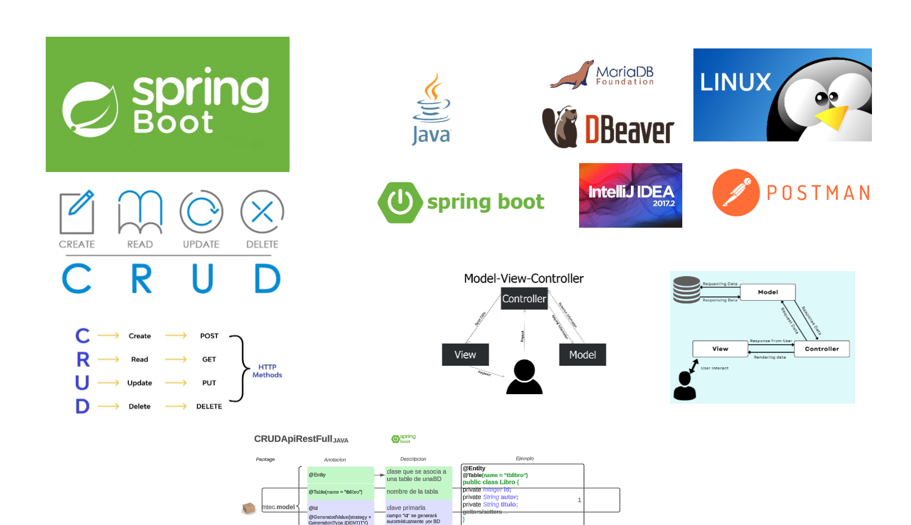
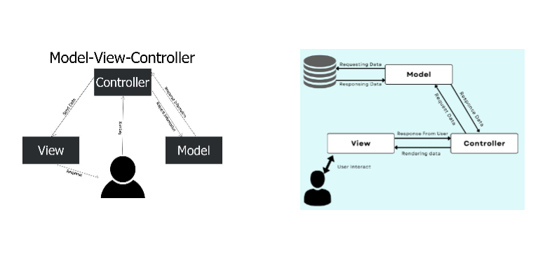
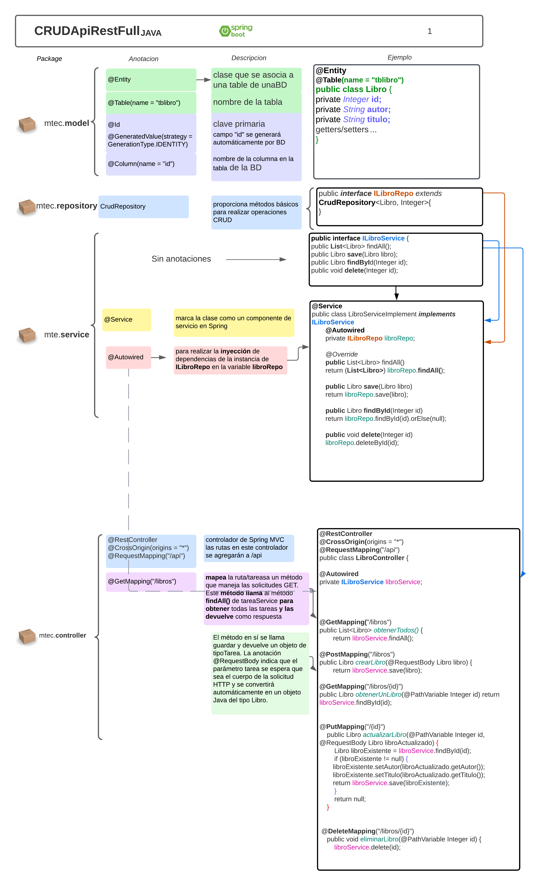

# Biblioteca CRUD API



## Descripción

Esta es una API CRUD para gestionar una colección de libros. Permite crear, leer, actualizar y eliminar libros. La API está construida usando Spring Boot y sigue el patrón de arquitectura MVC.

## Enlace de tutorial
 [Aqui el tutorial](https://www.youtube.com/watch?v=6A_0IExjVDE) del crud.

 
## Arquitectura MVC



## Modelo General y Paquetes



## Endpoints

### Crear un libro
http

```
POST /api/libro
```

### Ejemplo de cuerpo de solicitud

```
{
"titulo": "El nombre del libro",
"autor": "Autor del libro"
}

```

### Respuesta:
```
{
"id": 1,
"titulo": "El nombre del libro",
"autor": "Autor del libro"
}

```
### Obtener todos los libros
```
GET /api/libros

```

### Obtener todos los libros
```
[
{
"id": 1,
"titulo": "El nombre del libro",
"autor": "Autor del libro"
},
{
"id": 2,
"titulo": "Otro libro",
"autor": "Otro autor"
}
]

```

### Instalación
### Clona el repositorio:

```
git clone https://github.com/tu-usuario/biblioteca-crud.git
cd biblioteca-crud
Configura la base de datos en application.properties:
```

properties
```
spring.datasource.url=jdbc:mysql://localhost:3306/biblioteca
spring.datasource.username=tu_usuario
spring.datasource.password=tu_contraseña
spring.jpa.hibernate.ddl-auto=update
Ejecuta la aplicación:
```
sh
Copy code
```
./mvnw spring-boot:run
```